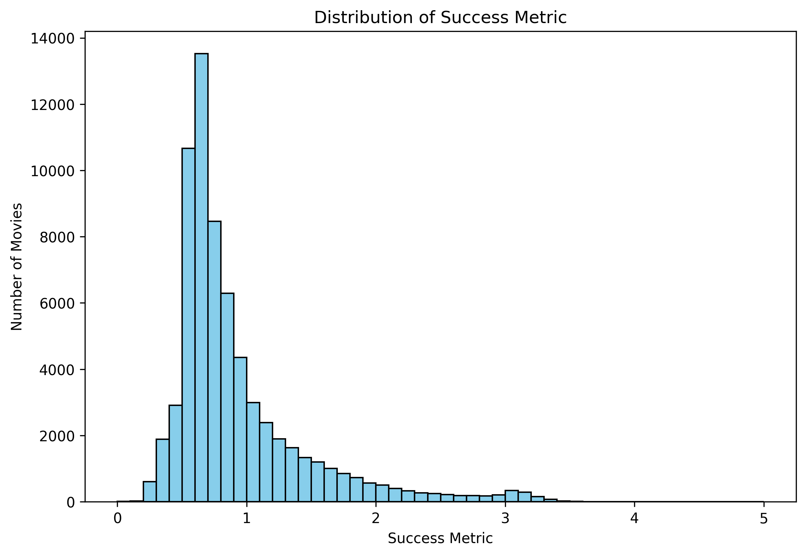

## Lights, Camera, and ... Action !

  

    Cinema has always been a mirror to society, showcasing both the highs and lows, being the canvas for the cultural statement and creating narratives that are worldwide, as well as more geographically inclined.
  

  

    The question of whether there is a "Golden Age" of cinema — a point in time of outstanding creativity, cultural impact, and economic success — still continues to be a passionate subject of exploration.
  

  

    Let's dive into different snapshots of the industry, through various datasets, in order to assess if a metric can be defined to quantify the success of a specific genre, or the industry as a whole. This, will then allow us to identify significant eras, and predict trends that may shape the industry's future.
  

  
  

    You might wonder where one would even start and know what defines a successful movie ? Is it it's box office revenue, is it how known it is, how popular it is with critics and fans ? How many languages it has been translated to or how many countries it has been distributed in ?  
  

  

    Worry not, as we have found the Industry's Secret 11 herbs and Spices, let's look at them together, and see if you can also figure it with us ! 
  

  

  The first question you might ask yourself probably relates to what will be cooking with ? What different ingredients do we have at disposition, what about the genres that are comprised within the huge coop that is the global movie industry.  
  

 <iframe src="assets/plots/genre_piechart.html" style="width: 100%; height: 620px; border: none;"></iframe>

  

    The first conclusion from this lovely distribution is that this lovely industry is quite a complex mix of genres.    
    Drama is the big winner, and by far, with a choke hold on nearly 14 % of the movies in our data (one might say ever, but let's not get too much ahead of ourselves). Comedy comes in, in a not so close second at about half of drama movies produced, with Romance rounding up the podium.  
    Only the top 20 movies were shown, as the 366 different genres would result in quite crowded donut...    
    The top 20 movies genres are still within the answers one would think about when trying to figure a genre, however there are some slightly more obscure ones further down the distribution. It might be better not to focus on the 2 movies on the Netherlands in World War II genre, so we will mostly focus on those better top 15 genres throughout the showdown. 
  

  

    Now, let's see what features one would need to chose to get a good recipe for a success metric !
  

 <iframe src="assets/plots/movie_metrics_all_genres.html" style="width: 100%; height: 500px; border: none;"></iframe>

  Well, well, well, what do we have here ?    
  Let us begin by looking at the Number of movies by genre over time. 
  The first thing to notice is that for nearly every genre, the production rate as massively increased since the beginning of movie production, bar a few exceptions. 
  Let's first start with the number of movies throughout the past century; there are few trends emerging already...    
  
<ol>
  <li>
  The most common trend is the simple exponential increase in movie production throughout the years, with representative genres like Drama or World Cinema. One can also see the small step-like plateaus in the increase, maybe implying small saturations every decade or so.
  </li>

  <li>
    The next interesting shape is how the Indie Genre underwent a rebirth, with many movies produced from the 1910s to 1930s, then a pseudo-death of the medium until a new life was instilled in the genre by the 60s. Could that be the transition from independent movie producers to big studio conglomerates, until the return of the amateur as technology got more accessible ?
  </li>

  <li>
    Finally, on a sadder note, some genres simply did not survive or just fell off. Yes, we're talking about you Mr. Black & White, or Ms. Silent. They simply weren't the same after the 60s and 30s respectively.
  </li>
</ol>

  What about a more common way of defining success, such as box office revenue, adjusted for inflation of course !  
  Here we can see the same trend emerging as before, with a slight mix up in the main players. With Drama, Action and Adventure now the highest grossing genres, Short Films and Musicals once earned some serious money, but those days are long gone.

  The next feature that one would need to analyze would be the popularity of a movie, this 

## How could we go about defining this "Golden age" ?
<ol> 
  <li>
    Has there ever been a "Golden Age" of cinema ? Which metrics are important to evaluate the global success of the cinema industry and, therefore, a potential "Golden Age" ?
  </li>
   
  <li>
    What were the specific ages of cinema throughout the years ? Is it possible to observe time-related trends about a specific genre or country ?
  </li>
   
  <li>
    What about now ? Are we in a specific era ? What are the past decade trends and what could we infer from this ? Can we build a strong metric that predicts a future trend and, therefore, a movie success ?
  </li>

</ol>

## Act I : A New Metric Awakens

 
 

  Voluptate deserunt elit ad officia enim voluptate duis nostrud culpa sint do laborum ad. Cupidatat amet enim aliqua esse eiusmod amet. Ut enim elit ad nostrud do eu sit sint tempor culpa ea dolor. Nisi exercitation elit id Lorem commodo culpa. Eiusmod irure velit ea id incididunt labore sint deserunt tempor. Eiusmod commodo voluptate ut exercitation et ipsum nulla.

 <iframe src="assets/plots/bubble_plot.html" style="width: 100%; height: 620px; border: none;"></iframe>

 <iframe src="assets/plots/success_score_distribution.html" style="width: 100%; height: 620px; border: none;"></iframe>

 <iframe src="assets/plots/top_movies_vertical_radiobuttons.html" style="width: 100%; height: 620px; border: none;"></iframe>

<iframe src="assets/plots/precomputed_choropleth_fixed_colorbar.html" style="width: 100%; height: 500px; border: none;"></iframe>

## Act II : Tell Me More

  Duis laborum pariatur sint culpa duis amet exercitation. Veniam consequat tempor labore consequat reprehenderit amet irure pariatur dolore proident occaecat pariatur voluptate. Aliquip eu velit magna laboris fugiat veniam sint officia eiusmod minim deserunt magna.

## Act III : I Can Now See the Way

Eiusmod sit voluptate cillum cupidatat dolore aliquip ut nulla mollit. Lorem fugiat consequat aliquip laboris qui laborum enim nostrud amet reprehenderit. Non ad cupidatat id cillum velit laboris Lorem. Dolore culpa ex exercitation est id laborum sit. Ex dolor excepteur ut voluptate eiusmod tempor ad excepteur labore enim. Id amet consectetur occaecat amet eiusmod.

## As The Curtains Close

  Excepteur pariatur qui reprehenderit mollit aliqua voluptate. Voluptate nisi amet ex ea esse velit laboris deserunt Lorem aute. Laborum pariatur elit magna qui. Cillum et irure adipisicing officia. Duis laborum pariatur sint culpa duis amet exercitation. Veniam consequat tempor labore consequat reprehenderit amet irure pariatur dolore proident occaecat pariatur voluptate. Aliquip eu velit magna laboris fugiat veniam sint officia eiusmod minim deserunt magna.

