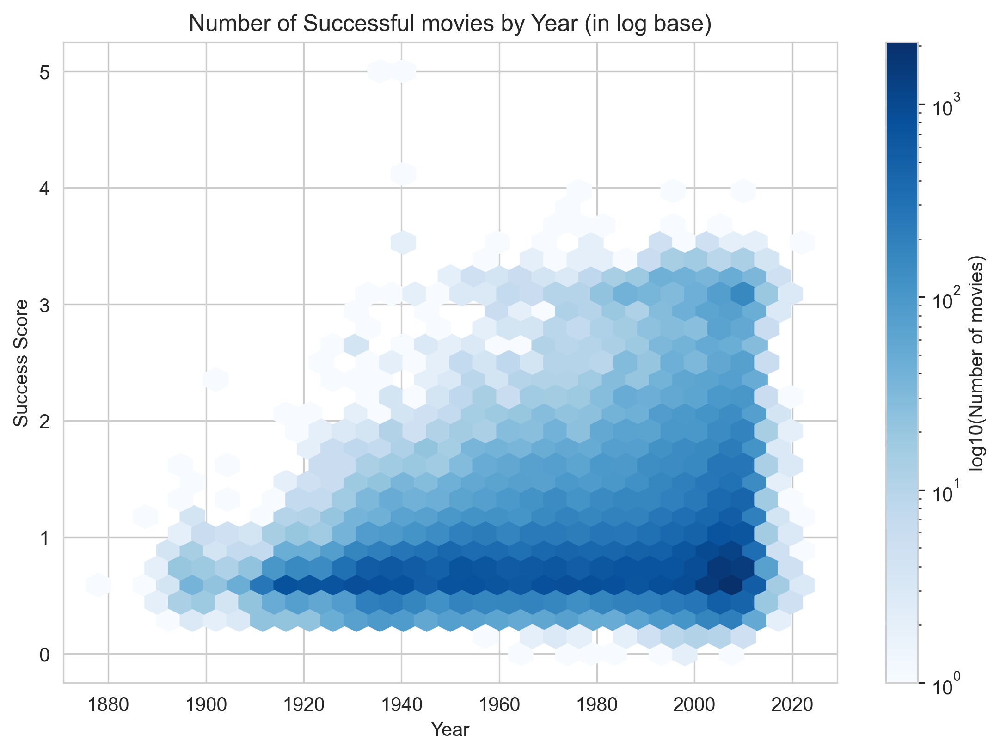

## Lights, Camera, and ... Action !

  

    Cinema has always been a mirror to society, showcasing both the highs and lows, being the canvas for the cultural statement and creating narratives that are worldwide, as well as more geographically inclined. The question of whether there is a "Golden Age" of cinema — a point in time of outstanding creativity, cultural impact, and economic success — still continues to be a passionate subject of exploration.
  

 
  

    Let's dive into different snapshots of the industry, through various datasets, in order to assess if a metric can be defined to quantify the success of a specific genre, or the industry as a whole. This, will then allow us to identify significant eras, and predict trends that may shape the industry's future.
  

  
  

    You might wonder where one would even start and know what defines a successful movie ? Is it it's box office revenue, is it how known it is, how popular it is with critics and fans ? How many languages it has been translated to or how many countries it has been distributed in ? Worry not, as we have found the Industry's Secret 11 herbs and Spices, let's look at them together, and see if you can also figure it with us ! 
  

  

  The first question you might ask yourself probably relates to what will be cooking with? What different ingredients do we have at disposition, what about the genres that are comprised within the huge coop that is the global movie industry.  
  

 <iframe src="assets/plots/genre_piechart.html" style="width: 100%; height: 620px; border: none;"></iframe>

  

    The first conclusion from this lovely distribution is that this lovely industry is quite a complex mix of genres.    
    Drama is the big winner, and by far, with a choke hold on nearly 14 % of the movies in our data (one might say ever, but let's not get too much ahead of ourselves). Comedy comes in, in a not so close second at about half of drama movies produced, with Romance rounding up the podium. Only the top 20 movies were shown, as the 366 different genres would result in quite crowded donut...    
    The top 20 movies genres are still within the answers one would think about when trying to figure a genre, however there are some slightly more obscure ones further down the distribution. It might be better not to focus on the 2 movies on the Netherlands in World War II genre, so we will mostly focus on those better top 15 genres throughout the showdown. 
  

  

    Now, let's see what features one would need to chose to get a good recipe for a success metric !
  

 <iframe src="assets/plots/movie_metrics_all_genres.html" style="width: 100%; height: 500px; border: none;"></iframe>

  Well, well, well, what do we have here ?    
  Let us begin by looking at the Number of movies by genre over time. The first thing to notice is that for nearly every genre, the production rate as massively increased since the beginning of movie production, bar a few exceptions.   
  Let's first start with the number of movies throughout the past century; there are few trends emerging already...    
  
<ul>
  <li>
  The most common trend is the simple exponential increase in movie production throughout the years, with representative genres like Drama or World Cinema. One can also see the small step-like plateaus in the increase, maybe implying small saturations every decade or so.
  </li> 

  <li>
    The next interesting shape is how the Indie Genre underwent a rebirth, with many movies produced from the 1910s to 1930s, then a pseudo-death of the medium until a new life was instilled in the genre by the 60s. Could that be the transition from independent movie producers to big studio conglomerates, until the return of the amateur as technology got more accessible ?
  </li> 

  <li>
    Finally, on a sadder note, some genres simply did not survive or just fell off. Yes, we're talking about you Mr. Black & White, or Ms. Silent. They simply weren't the same after the 60s and 30s respectively.
  </li>
</ul>

  What about a more common way of defining success, such as box office revenue, adjusted for inflation of course!
  Here we can see the same trend emerging as before, with a slight mix up in the main players. With Drama, Action and Adventure now the highest grossing genres, Short Films and Musicals once earned some serious money, but those days are long gone.

  The next feature that one would need to analyze would be the popularity of a movie. This is pulled from the IMDB website and dataset, and calculated based on how a movie is perceived by the the online audience compared to the rest of the movies available, see it as a nice and friendly contest which rewards heavily popular movies, thus putting an emphasis on movies that are currently enjoyed as well as all time great movies.   
  Here, we can see a few trends appear out of our delicious data :
  <ul>
    <li>
      An increase in popularity, in more recent movies for genres such as Action, Adventure or even Crime Fiction. 
    </li> 

  <li>
      A stable popular view for Genres like World Cinema, which seems to be enjoyed for any of its movies equally.
  </li> 

  <li>
    And a more appreciative view of old movies and more recent ones with a gap in the middle for genres like Black & White, or Indie.
  </li>
  </ul>
  One must note the lack of popularity score for some genres, either irregularly or before a set time, due to the data acquisition from this shared dataset, as well as how the score itself is given with a vast majority of low popularity scores, with some ultra popular scorers. Yes, Adventure we can see that peak.

  For the next feature, we wanted to be nice and chew up the work a bit for you. We thus collected a big chunk of reviews online, fed them through a RoBERTa Sentiment Analysis (SA) pipeline, and obtained a score from -1 to 1 (relatively to the review's satisfaction) that we added for each year of a genre thus giving the mean SA score for that year.   
  Hence, the very nature of this score is dependant on the availability of reviews for this movie and big gaps may occur... A general trend though is that the mean SA score is at least slightly positive with greater variation on years not in the 90s to 2010s (where a consensus was seemingly reached, or reviews simply started to be boringly similar).

  Last but not least, the Average Rating was obtained and is similar in nature to the SA Score in how it portrays our data, with coming from the same dataset a lack of data points. It also possesses the same 20 year quirk with this weird consensus...

  Great, we now have collected all the Secret Ingredients for a Killer Recipe ! What comes next is to assemble the Avengers, and save Marvel and the Movie Industry from making boring movies for the rest of our lives... Hard task, but heroes must be brave.    
  Let's see how our success metric can be assembled to have a coherent view on the industry.

## Act I : A New Metric Awakens

  

    So far, so good, right ? Now, let's assemble all this into a not so black box ! 
  <ol> <li>
    Let's first start by capping the popularity scores to no more than 28, as those outlandishly popular values would bring our success metric to favor those movies.
  </li>
   
  <li>
    Now let's normalize the ratings, the inflation-adjusted box office revenue, the popularity score. This will allow the metric to assess where one feature is behind in a movie.
  </li>
 
  <li>
    Now, let's penalize the movies that have low vote counts in the ratings, so to not favor movies that have 1 or 2 excellent, but misleading, reviews.
  </li>
 
  <li>
    Now for a bit of black magic, instead of dropping the missing values in our columns, we will give as missing input the mean of the column, this will not make any of the best movies any worse and change the mean values. The only downside is the case where it is missing the data because it is an obscure weird movie. No worries, it works like a charm !
  </li>
 
  <li>
    Combine it all by adding a pondered average with specific weights for each feature ; popularity with 10, the adjusted box-office with 8, the SA Score with 3, and finally give a weight of 3 for the ratings. This will minimize the missing data in the ratings and SA scores, and not influence our distribution too much. Bring it back to a score out of 5 by normalizing it, and doneso !
  </li>
  </ol>
 
  Et voilà !!! A perfectly nice score out of 5, which is a nicely accurate description of the success of a film. Let's check what it all looks like, and let's also verify that the top scoring movies are actually movies that were quite successful in their own ways !
  

 <iframe src="assets/plots/top_movies_vertical_radiobuttons.html" style="width: 100%; height: 620px; border: none;"></iframe>

  

    Great, I don't know about you, but as a fine film connoisseur, I ain't much too surprised with those movies.
    Who hasn't cried in front of Bambi ??? Don't say you haven't we all know it's a big fat lie, don't worry this story is a safe space.   
    Nonetheless, all the movies that we see here are a hallmark of some sort, with different genres represented as well, and different timescales, implying that our success metric can be used accurately on a broad field of movies !   
    When looking at how Bambi scored, it's excellent score comes from a combination of excellent box office adjusted for inflation, and a popularity score that was higher than the clipping value thus excellent, as well as good SA scores and ratings. A recipe for success, one might say... 
  

 <iframe src="assets/plots/success_score_distribution.html" style="width: 100%; height: 620px; border: none;"></iframe>

  

    This distribution looks quite pleasing, not exactly a perfect Normal Gaussian Distribution, but not too far off ! Some outliers here and there, but this is normal as we are normalizing them on those MinMax values.    
    What can we say, this looks promising, the average Success Score isn't quite high, but still high enough to be able to use without too much worries.
    Now let's look at the evolution of the temporal distribution of our Success Scores, regardless of the genres.
  

 

  

    That looks quite appetizing ! Your eagle eyes might have seen that a baseline around the mean Success Metric appeared. With more and more spread for higher Success Scores as time evolved. One can see the faint distribution of the top scorers, ranging from the late 30s all the way to nowadays.    
    The sharp increase in movie production can still be accounted for while still having the mean Success Score stable. This makes sense as more movies are produced, one is bound to not only produce more mediocre movies as well more good ones. This Success Metric looks rock solid to me !
  

  

  Now that we know how the metric evolves temporally, let's peek at how it evolves through space and what we can infer from that.
  

<iframe src="assets/plots/precomputed_choropleth_fixed_colorbar.html" style="width: 100%; height: 500px; border: none;"></iframe>

  Interesting, when looking at the worldwide distribution of the mean Success Score for the top 10 best movies, you can probably see that the United States are nearly one full point ahead of the next closest country, with the spatial repartition mostly around the most developed countries (not too surprising unfortunately).   
  When increasing the mean to more and more movies, three things jump to our minds :   
  <ul>
  <li> The United States truly have a grip on the best movies as it is only when taking all the movies that we see the mean Success Score dips below 3.</li>  
  <li> Japan and France are the only countries that can stay within a point of the US all the way until we're taking the full dataset. </li> 
  <li> When looking at all the movies, you can grasp how the movie produced per country will influence the mean score per country as the United Arab Emirates and Libya shoot up the rankings, even in front of the US, showcasing how producing a vast amount of all kinds of movies can lead to the mean Success Score to drop behind smaller production countries. </li>
  </ul>
  

    Now that we have an accurate way of defining success, what can we say about the most successful time frame for a specific genre ? Let's take a look at this together.
  

## Act II : Tell Me More

 <iframe src="assets/plots/bubble_plot.html" style="width: 100%; height: 620px; border: none;"></iframe>

  

    Let's dig in to the juicy results now...    
    Overall, you will notice that the mean Success Score per decade is increasing for nearly all genres, indicating that our movie producers also seem to be constantly on the hunt for better ideas, better realizations, and thus ever more money in their pockets... Let's look at it in more details :
    <ul>
    <li> Some genres seem to be more and more successful as time goes on, what exactly are people seeking to distract themselves from the boring day to day life ? Well, it seems that adrenaline filled Action and Adrenaline movies seem to be exponentially more successful. I guess we simply all want to feel something in our cold little hearts.</li>  
    <li> Surprisingly, feel good movies aren't ageing as well as action packed movies, with  Romance-related movies  not improving too much</li>  
    <li>Some genres appear to be more stubborn, or simply less suited to the greater audience. Documentaries, short films and comedy films might simply have exhausted their allocated space in people's hearts...
    </li>  
    <li> More doesn't mean better, there might be a bit too much Drama in people's lives...</li>
  </ul>
  

<iframe src="assets/plots/horbar_decade.html" style="width: 100%; height: 570px; border: none;"></iframe>

  

    Well, recent years seem to be promising for most genres, with the adrenaline filled genres being impressively successful. But let's not get too happy as the sample cluster might be reduced on these time frames thus artificially boosting the mean by having fewer samples...    
    Some genres such Documentaries, Silent Films and even Romance Films have peaked on the other hand... Even though, few Black & White were produced in the 80s, they were more successful than in the hey day of Black and White Movies... Another case of low sample count ?
  

  

    Let's delve deeper on some representing genres to see if we can further define their Golden Days !
  

## Act III : I Can Now See the Way

  

  For the final act of our grand data journey, we gazed into the crystal ball and predicted future trends in the movie industry. To do this, we combined the data of our success metric for each genre and projected their influence on the movie industry. This allowed us to compare the impact of each genre over time. When calculating the impact, we focused on two main points:
  

  - Scaling: More successful movies have more of an impact. Makes sense right?
  - Causality: No time travelling in this movie! We do not want the success of a movie to have an impact before it's release.

  

  Also, to keep the graphs visually pleasing, we are only going to keep genres with more than 3000 movies. This represents a total of 19 genres!
  

<iframe src="assets/plots/impact_timeseries_jet_r.html" style="width: 100%; height: 500px; border: none;"></iframe>

We can check if these impact timeseries are in agreement with the golden ages we found in the previous parts. To better visualize this, we can normalize the impact for each genre and plot them over time to find the following plot:

<iframe src="assets/plots/normalized_impact_heatmap.html" style="width: 100%; height: 500px; border: none;"></iframe>

  

  From these graphs, one thing is clear: The movie industry is thriving! We can see a real explosion of the impact over the recent years. This can in part be explained by our dataset having more data about recent movies. 
  

  

  Another interesting thing to note is that eventhough all genres seem to be experiencing a golden age in recent year, there are two outliers: Black-and-White movies and Silent films. They experienced their golden age in the 40's and in the 30's respectively. 
  

  

  Finally, even before gazing into the crystal ball, we can see that Comedy films have experienced a sudden growth in recent years. This may indicate a future golden age for this genre in the future. However, this remains to be seen from our predictions. 
  
 

  

  One last thing we can do before looking at the prediction is evaluating the relative impact of each genre for different time periods.
  
 

<iframe src="assets/plots/relativeImpactRadar.html" style="width: 100%; height: 820px; border: none;"></iframe>

  

  We can see from this graph the slow decline of the Black-and-White movies who once represented more than 35% of the impact. This domination has been replaced by the Dramas throughout the 60's until the 2010's. However, this domination seems to be slowing down, with new genres emerging such as Thrillers, Action movies and Comedies. But enough said about the past. Let's now look into the future!
  

## Final Act: The Curtain Falls

Cinema has always been a reflection of society, constantly evolving and adapting. Over the years, it has transformed significantly with advancements in technology and shifts in cultural perspectives, giving rise to new genres and fresh ideas. Our "Success Metric" highlights how films, genres, and eras have left an indelible mark, demonstrating that the Golden Age of cinema is not a singular moment but an ongoing journey. Let’s sit and explore the future as the next chapter of cinema unfolds.
 

